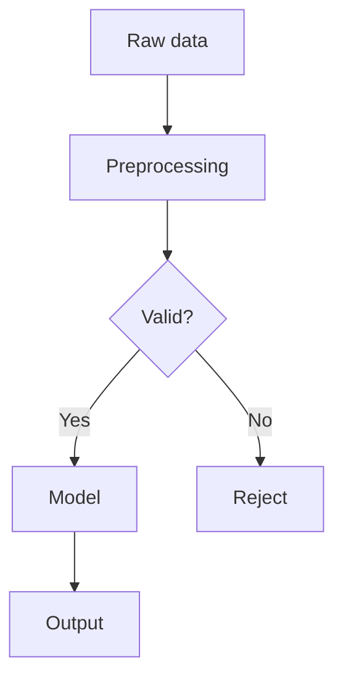
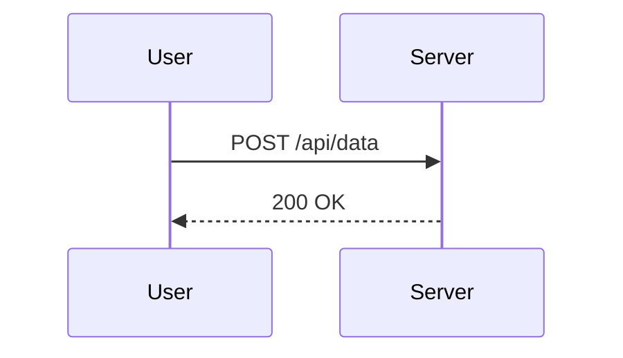
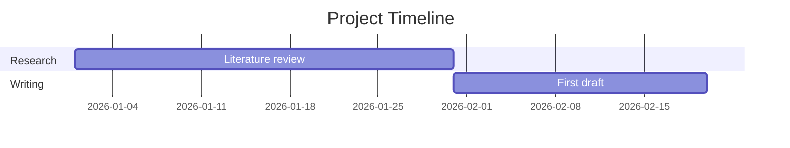
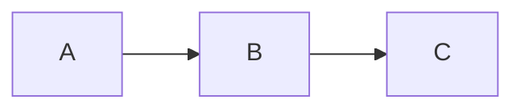

# Loom — Theme Reference

A complete reference for building, configuring, and writing content for the Loom Jekyll theme.


---

## 1. Prerequisites

| Tool | Required version | Check |
|------|-----------------|-------|
| Ruby | 3.3 | `ruby -v` |
| Bundler | any recent | `bundler -v` |
| Node.js | 20 | `node -v` |
| npm | bundled with Node 20 | `npm -v` |

Install Ruby gems:

```bash
bundle install
```

Install Node packages:

```bash
npm install
```

---

## 2. Local development

Two processes run in parallel during development.

**Terminal 1 — build CSS and JavaScript (Vite):**

```bash
npm run dev
```

Vite watches `src/main.css` and `src/main.js`, rebuilds to `assets/built/` on change.

**Terminal 2 — run Jekyll:**

```bash
bundle exec jekyll serve --livereload
```

Site is available at `http://localhost:4000`.

> **Note on search:** Pagefind requires a completed `_site/` directory to index. Search will return no results in local development unless you run the indexer manually after a full build:
>
> ```bash
> npm run build && bundle exec jekyll build && npx pagefind --site _site
> ```
>
> Then start the Jekyll server pointing at the already-built `_site/`:
>
> ```bash
> bundle exec jekyll serve --skip-initial-build
> ```

---

## 3. Configuration

All site-wide settings live in `_config.yml`.

### Core identity

```yaml
title: LoomCollective
description: Clean typography, dark mode, computational essays.
url: "https://loomcollective.ai"   # Full URL including scheme, no trailing slash
baseurl: ""                        # Empty for apex domains; "/path" for subpaths
author: Your Name
lang: en
```

### Permalink and pagination

```yaml
permalink: /:title/                # Post URLs: /my-post-slug/
future: true                       # Publish posts with future dates

pagination:
  enabled: true
  per_page: 12
  permalink: "/page/:num/"
  title: ":title — page :num"
  trail:
    before: 2
    after: 2
```

### Navigation menus

```yaml
# Header — main nav links
navigation:
  - title: Home
    url: /
  - title: Topics
    url: /topics/
  - title: Archive
    url: /archive/

# Footer — secondary links (About, RSS, etc.)
secondary_navigation:
  - title: About
    url: /about/
  - title: RSS
    url: /feed.xml
```

### Social links

```yaml
twitter: your_handle      # X/Twitter username only, no @
facebook: your_page       # Facebook page name
```

Both are optional — remove the key or leave blank to hide the icon in the footer.

### Analytics

```yaml
analytics_token: ""       # Cloudflare Web Analytics token
```

See [§10 Analytics](#10-analytics) for setup.

### Comments

```yaml
giscus:
  repo: ""                # Owner/repo — e.g., pauldhobson/loomcollective
  repo_id: ""             # From giscus.app
  category: "Announcements"
  category_id: ""         # From giscus.app
```

See [§9 Comments](#9-comments) for setup.

### Archive pages

```yaml
jekyll-archives:
  enabled:
    - categories          # Generates /topic/:name/ pages
    - tags                # Generates /tag/:name/ pages
  layouts:
    category: topic
    tag: tag
  permalinks:
    category: /topic/:name/
    tag: /tag/:name/
```

### Default front matter

```yaml
defaults:
  - scope:
      path: "_posts"
    values:
      layout: post
      image: /assets/images/og-default.png   # Fallback OG image
  - scope:
      path: "_pages"
    values:
      layout: default
```

---

## 4. Writing posts

### File naming

Create files in `_posts/` following the date-slug convention:

```
_posts/2026-03-01-my-post-title.md
```

### Front matter reference

```yaml
---
layout: post                        # Required

# Content
title: "Post title"                 # Required
date: 2026-03-01                    # Required — matches filename date
excerpt: "One or two sentences."    # Optional — used in cards and meta description

# Taxonomy
categories: [Energy]                # Optional — one category recommended; used for /topic/ archive
tags: [solar, policy, net-zero]     # Optional — multiple tags; used for /tag/ archive

# Authorship
author: paul-hobson                 # Optional — slug from _data/authors.yml; falls back to site.author

# Images
image: /assets/images/feature.jpg   # Optional — feature image at top of post
image_alt: "Panel arrays at dusk"   # Optional — alt text for accessibility
image_caption: "Photo: Jane Doe"    # Optional — caption below image

# Display options
featured: true                      # Optional — shows in Featured section on home page
updated: 2026-03-15                 # Optional — shows "Updated" date in post header

# Series (see §11)
series: "Series Name"               # Optional — must match exactly across posts
series_order: 1                     # Optional — integer, ascending

# Features
comments: true                      # Optional — enables Giscus comments widget

# Viz library flags (see §6)
# These add body classes that trigger CDN loading.
# All are auto-detected from content too — flags just guarantee loading.
math: true
diagram: true
viz: true
d3: true
leaflet: true
geo: true
---
```

### Post content

Posts are written in standard Markdown (Kramdown). Use any standard Markdown elements:

```markdown
## Heading (auto-linked anchor)

Regular paragraph. **Bold.** _Italic._ `Inline code`.

> Blockquote text.

- Unordered list
- Item two

1. Ordered list
2. Item two

[Link text](https://example.com)


```

### Code blocks

Language-tagged code blocks get syntax highlighting (Rouge) and a copy button automatically:

````markdown
```python
def ricker(r, x):
    return r * x * (1 - x)
```
````

### Post footer

Every post automatically gets:
- Tags as clickable chips
- Share buttons (X/Twitter, LinkedIn, copy link)
- Subscribe CTA
- Giscus comments (if `comments: true`)
- Related posts (if tag/category matches exist)
- Previous / next post navigation

---

## 5. Computational essays

Essays use a three-column layout: sticky table of contents (left), content (centre), sidenotes (right). The layout collapses responsively to two columns on tablets and one column on mobile.

### Front matter

```yaml
---
layout: essay       # Required — enables 3-column layout, TOC, sidenotes, progress bar
title: "Essay title"
date: 2026-03-01
excerpt: "Summary."
categories: [Mathematics]
tags: [ecology, population-dynamics]
image: /assets/images/essay-hero.jpg
image_alt: "Description"
image_caption: "Caption"
series: "Series Name"
series_order: 2
comments: true
updated: 2026-03-15

# Viz flags — set all that apply
math: true
viz: true
story: true         # Loads Scrollama for scrollytelling sections
---
```

### Table of contents

Built automatically from all `## h2` and `### h3` headings in the content. No markup required.

To exclude a heading from the TOC:

```html
<h2 data-notoc>This heading is excluded</h2>
```

### Sidenotes

Tufte-style margin notes. On desktop they appear in the right column; on mobile they appear inline.

```html
<p>
  The Ricker model<span class="sidenote-anchor" data-sn="1"></span> was originally
  developed for salmon population studies.
</p>
<aside class="sidenote" data-sn="1">
  Ricker, W.E. (1954). Stock and Recruitment. <em>J. Fish. Res. Board Can.</em> 11(5):559–623.
</aside>
```

The `data-sn` attribute links anchor to note — use the same integer for both. Numbers are displayed automatically.

### Endnotes / references

Inline `<cite>` elements are collected and rendered as a numbered reference list at the end of the essay.

```html
<p>
  This was described by Lorenz<cite data-cite="Lorenz, E.N. (1963). Deterministic nonperiodic flow."></cite>
  as sensitive dependence on initial conditions.
</p>
```

If the `data-cite` value starts with `http://` or `https://`, it renders as a hyperlink.

### Callouts

```html
<div class="callout callout-note">
  <span class="callout-icon">💡</span>
  <div class="callout-body">
    <p>Key insight or tip.</p>
  </div>
</div>

<div class="callout callout-warning">
  <span class="callout-icon">⚠️</span>
  <div class="callout-body">
    <p>Something to watch out for.</p>
  </div>
</div>

<div class="callout callout-definition">
  <span class="callout-icon">📖</span>
  <div class="callout-body">
    <p><strong>Term:</strong> Definition text.</p>
  </div>
</div>

<div class="callout callout-takeaway">
  <span class="callout-icon">✓</span>
  <div class="callout-body">
    <p>Key takeaway from this section.</p>
  </div>
</div>
```

### Scrollytelling

Requires `story: true` in front matter.

A story section pins a visualisation in the viewport while narrative steps scroll past. Each step can update the pinned visualisation.

```html
<section class="story-section">
  <div class="story-sticky">
    <div class="story-graphic">
      <!-- Pinned viz — stays visible while steps scroll -->
      <div data-leaflet id="city-map" style="height:100%"
           data-lat="51.505" data-lng="-0.09" data-zoom="10"></div>
    </div>
  </div>

  <div class="story-steps">
    <!-- Each step triggers an update when it enters the viewport -->
    <div class="story-step" data-step="0"
         data-update='{"city-map": {"lat": 51.505, "lng": -0.09, "zoom": 10}}'>
      <p>London. Population 9 million.</p>
    </div>

    <div class="story-step" data-step="1"
         data-update='{"city-map": {"lat": 48.856, "lng": 2.352, "zoom": 12}}'>
      <p>Paris. Population 11 million.</p>
    </div>
  </div>
</section>
```

The `data-update` JSON maps element IDs to update payloads. Keys are element IDs; values are adapter-specific (see each visualisation type below).

Arrow keys navigate between steps.

### Reading progress bar

Added automatically to essay pages. A 2px accent-coloured bar at the top of the viewport fills as you scroll. Respects `prefers-reduced-motion`.

---

## 6. Visualisations

The viz runtime (`assets/js/core.js`) scans the page after load, detects which libraries are needed, fetches them from CDN, and mounts each visualisation. Nothing loads on pages that don't use it.

Detection is automatic via element selectors (`[data-viz]`, `[data-d3]`, etc.) or body-class flags set by front matter. Use the front matter flags when you want to guarantee a library loads even if detection would otherwise miss it (e.g. math in a post with no `$` signs but with `<span class="math-display">`).

---

### Mathematics — KaTeX

**Front matter flag:** `math: true`
**Auto-detection:** `$` signs in content, `.math`, `.math-inline`, `.math-display` elements.

**Inline:**

```markdown
The logistic map is $x_{n+1} = r x_n (1 - x_n)$.
```

**Display (centred block):**

```markdown
$$
x_{n+1} = r x_n (1 - x_n)
$$
```

**LaTeX delimiters also supported:**

```markdown
Inline: \( \sigma = \sqrt{\text{Var}(X)} \)

Display: \[ E[X] = \mu \]
```

Code blocks are excluded from rendering — KaTeX never processes content inside `` ` `` or ```` ``` ```` fences.

---

### Diagrams — Mermaid

**Front matter flag:** `diagram: true`
**Auto-detection:** `.mermaid` elements, `code.language-mermaid` blocks.

Use a fenced code block with the `mermaid` language tag:

````markdown

````

Other supported Mermaid diagram types:

````markdown

````

````markdown

````

The theme is automatically set to Mermaid's `dark` or `default` based on the current colour scheme.

---

### Charts — ECharts

**Front matter flag:** `viz: true`
**Auto-detection:** `[data-viz]` elements.

Pass the full [ECharts option object](https://echarts.apache.org/en/option.html) as JSON in `data-options`. The `loom` theme is pre-registered with accent colours matching the site palette.

**Bar chart:**

```html
<div data-viz="echarts" style="height:320px" data-options='{
  "tooltip": {"trigger": "axis"},
  "xAxis": {"type": "category", "data": ["Coal", "Gas", "Solar", "Wind"]},
  "yAxis": {"type": "value", "name": "GW"},
  "series": [{"type": "bar", "data": [102, 87, 230, 116]}]
}'></div>
```

**Line chart:**

```html
<div data-viz="echarts" style="height:300px" data-options='{
  "tooltip": {"trigger": "axis"},
  "xAxis": {"type": "category", "data": ["2020", "2021", "2022", "2023", "2024"]},
  "yAxis": {"type": "value"},
  "series": [{"type": "line", "smooth": true, "data": [1.2, 1.8, 2.6, 3.9, 5.1]}]
}'></div>
```

**Scrolly update:**

Give the element an `id`, then reference it in each story step's `data-update`:

```html
<div data-viz="echarts" id="energy-chart" style="height:300px" data-options='{
  "xAxis": {"type": "category", "data": ["Coal", "Gas", "Solar"]},
  "yAxis": {"type": "value"},
  "series": [{"type": "bar", "data": [102, 87, 12]}]
}'></div>

<div class="story-step" data-step="1"
     data-update='{"energy-chart": {"series": [{"data": [80, 60, 230]}]}}'>
  <p>By 2030, solar overtook both fossil fuels.</p>
</div>
```

The `data-update` value is passed directly to ECharts `setOption()`, so any partial update supported by ECharts works here.

---

### Charts — D3

**Front matter flag:** `d3: true`
**Auto-detection:** `[data-d3]` elements.

D3 loads a selective ~120 KB bundle (selection, scale, axis, array, shape, force, drag, transition) via dynamic import — only on pages that use it.

Three built-in chart types:

**Horizontal bar chart:**

```html
<div data-d3="bar" style="height:300px" data-options='{
  "data": [
    {"label": "Solar", "value": 230},
    {"label": "Wind",  "value": 116},
    {"label": "Hydro", "value": 37}
  ]
}'></div>
```

Optional: `"color": "#F0177A"` in options overrides bar colour.

**Line chart:**

```html
<div data-d3="line" style="height:260px" data-options='{
  "data": [
    {"x": 2000, "value": 1.2},
    {"x": 2010, "value": 3.9},
    {"x": 2020, "value": 9.4}
  ]
}'></div>
```

**Force-directed graph:**

```html
<div data-d3="force" style="height:360px" data-options='{
  "data": {
    "nodes": [{"id": "A"}, {"id": "B"}, {"id": "C"}],
    "links": [{"source": "A", "target": "B"}, {"source": "B", "target": "C"}]
  }
}'></div>
```

Nodes are draggable.

**Custom chart types:**

Register your own factory in an HTML block inside the post:

```html
<script type="module">
import { registerD3Chart } from '/assets/js/viz/d3.js';

registerD3Chart('scatter', (el, data, options) => {
  const d3 = window.d3;  // set after first render on this page

  const svg = d3.select(el).append('svg')
    .attr('width', el.offsetWidth)
    .attr('height', el.offsetHeight);

  // … render scatter plot …

  return {
    update(newData) {
      // Re-render with newData when a scrolly step fires
    }
  };
});
</script>

<div data-d3="scatter" style="height:300px"
     data-options='{"data": [{"x": 1, "y": 2}, {"x": 3, "y": 1}]}'></div>
```

**Scrolly update:**

```html
<div data-d3="bar" id="pop-chart" style="height:280px" data-options='{
  "data": [{"label": "1970", "value": 3.7}]
}'></div>

<div class="story-step" data-step="1"
     data-update='{"pop-chart": {"data": [
       {"label": "1970", "value": 3.7},
       {"label": "2024", "value": 8.1}
     ]}}'>
  <p>Population doubled in fifty years.</p>
</div>
```

---

### Ricker population model

An interactive widget with sliders for growth rate `r`, initial value `x₀`, and iterations `n`. Includes a time-series chart and a phase plot.

**Requires:** `viz: true` in front matter (needs ECharts).

**Static widget with sliders:**

```html
<div data-viz="ricker" style="height:360px;"></div>
```

**Scrollytelling variant (no sliders, updates from story steps):**

```html
<div data-viz="ricker-scrolly"></div>
```

---

### Maps — Leaflet (no API key required)

**Front matter flag:** `leaflet: true`
**Auto-detection:** `[data-leaflet]` elements.

```html
<div data-leaflet style="height:400px"
     data-lat="51.505"
     data-lng="-0.09"
     data-zoom="13"></div>
```

**Tile presets** (`data-tiles` attribute):

| Value | Tiles |
|-------|-------|
| `osm` (default) | OpenStreetMap |
| `carto` | CartoDB Positron (light, minimal) |
| `carto-dark` | CartoDB Dark Matter |
| `stadia` | Stadia Alidade Smooth |

Dark mode automatically swaps the tile layer to `carto-dark`.

**Markers:**

```html
<div data-leaflet style="height:400px"
     data-lat="51.505" data-lng="-0.09" data-zoom="12"
     data-tiles="carto"
     data-markers='[
       {"lat": 51.505, "lng": -0.09, "label": "London"},
       {"lat": 51.524, "lng": -0.13, "label": "King&apos;s Cross"}
     ]'></div>
```

**Scrolly update** (fly to new position):

```html
<div data-leaflet id="city-map" style="height:100%"
     data-lat="51.505" data-lng="-0.09" data-zoom="10"></div>

<div class="story-step" data-step="0"
     data-update='{"city-map": {"lat": 51.505, "lng": -0.09, "zoom": 10}}'>
  <p>Greater London.</p>
</div>
<div class="story-step" data-step="1"
     data-update='{"city-map": {"lat": 48.856, "lng": 2.352, "zoom": 12, "animate": true}}'>
  <p>Paris.</p>
</div>
```

`animate: true` (default) smoothly flies to the new position. Set `false` for an instant jump.

---

### Maps — Mapbox GL (requires API token)

**Front matter flag:** `geo: true`
**Auto-detection:** `[data-map]` elements.

**Token setup** — add your public token to `_config.yml`:

```yaml
mapbox_token: "pk.eyJ..."
```

This is injected as `window.MAPBOX_TOKEN` automatically by `_includes/head.html` on every page. For a token you don't want in source control, use a GitHub Actions secret instead (see §17).

Or pass per-element to override the global token:

```html
<div data-map="calgary" data-token="pk.eyJ..." style="height:500px;"></div>
```

**Preset locations:**

```html
<div data-map="calgary"   style="height:400px;"></div>
<div data-map="edmonton"  style="height:400px;"></div>
<div data-map="vancouver" style="height:400px;"></div>
<div data-map="toronto"   style="height:400px;"></div>
<div data-map="world"     style="height:400px;"></div>
```

**Custom centre and zoom:**

```html
<div data-map="custom" style="height:400px;"
     data-center="-113.5,51.0"
     data-zoom="10"></div>
```

`data-center` is `longitude,latitude` (note order — Mapbox convention).

For token-free interactive maps, prefer Leaflet above.

---

## 7. Search

Search is powered by [Pagefind](https://pagefind.app), which indexes the built `_site/` directory at CI time and ships the index as static files alongside the site. No server is required.

### How it works

1. Jekyll builds the site to `_site/`
2. `npx pagefind --site _site` crawls the HTML and writes `_site/pagefind/`
3. The deploy artifact includes the Pagefind index
4. At runtime, the search component dynamically imports `/pagefind/pagefind.js` on first open
5. Searches run entirely client-side against the local index

### UI

- **Search button** in the header (magnifying glass icon)
- **Keyboard shortcut:** `⌘K` (Mac) or `Ctrl+K` (Windows / Linux)
- **Close:** `ESC` key or click outside the panel
- Results show title + highlighted excerpt
- Matched terms are highlighted in pink (the accent colour)

### Using search locally

After a full `jekyll build`, run Pagefind and then serve the already-built site:

```bash
npm run build
bundle exec jekyll build
npx pagefind --site _site
bundle exec jekyll serve --skip-initial-build
```

Browse to `http://localhost:4000` and search will work.

> Running `jekyll serve` (without `--skip-initial-build`) overwrites `_site/` and removes the Pagefind index. Always build first, then serve.

### Excluding content from the index

Pagefind indexes all HTML by default. To exclude a section:

```html
<div data-pagefind-ignore>
  This content will not appear in search results.
</div>
```

To exclude an entire page, add to its front matter:

```yaml
---
exclude_from_search: true
---
```

Then add a hook in `_plugins/` or a Pagefind config file — see [Pagefind docs](https://pagefind.app/docs/config-options/).

### CI integration

The `npx pagefind --site _site` step in `.github/workflows/deploy.yml` runs automatically after `jekyll build`. No additional configuration is needed for deployment.

---

## 8. Navigation

### Header

Defined in `_config.yml` under `navigation:`. Active state is applied automatically when `page.url` matches the item URL.

```yaml
navigation:
  - title: Home
    url: /
  - title: Topics
    url: /topics/
  - title: Archive
    url: /archive/
  - title: About
    url: /about/
```

### Footer — secondary links

Defined in `_config.yml` under `secondary_navigation:`:

```yaml
secondary_navigation:
  - title: About
    url: /about/
  - title: Privacy
    url: /privacy/
  - title: RSS
    url: /feed.xml
```

The footer Topics column is populated automatically from the six most-used categories.

### Mobile navigation

The header collapses to a hamburger on small screens. The drawer opens/closes with the hamburger button and also closes on `ESC` or clicking outside.

---

## 9. Comments

Comments use [Giscus](https://giscus.app), backed by GitHub Discussions. Comments are stored in your repo's Discussions tab — no third-party database.

### Setup

1. Enable **Discussions** on your GitHub repo (Settings → General → Features → Discussions).
2. Install the [Giscus app](https://github.com/apps/giscus) and grant it access to your repo.
3. Go to [giscus.app](https://giscus.app), enter your repo, select a discussion category, and copy the generated values.

### Configuration

Add the values to `_config.yml`:

```yaml
giscus:
  repo: "pauldhobson/loomcollective"    # owner/repo
  repo_id: "R_kgDOJ5..."                # from giscus.app
  category: "Announcements"
  category_id: "DIC_kwDOJ5..."          # from giscus.app
```

### Enabling per post

Add `comments: true` to any post or essay front matter:

```yaml
---
layout: post
title: "My Post"
comments: true
---
```

Comments will not appear on posts without `comments: true`, even if Giscus is configured.

### Dark mode

The Giscus widget automatically follows the site's colour scheme. When you toggle dark mode, a `postMessage` is sent to the Giscus iframe to update its theme in real time.

---

## 10. Analytics

The theme is wired for Cloudflare Web Analytics, which is privacy-respecting and free on Cloudflare's free plan.

### Setup

1. Create a [Cloudflare account](https://dash.cloudflare.com) if you don't have one.
2. Go to **Websites** → add your domain (or use Cloudflare Pages hosting).
3. Go to **Analytics & Logs → Web Analytics** → add your site.
4. Copy the analytics token (a long hex string).

### Configuration

Paste the token into `_config.yml`:

```yaml
analytics_token: "abc123def456..."
```

The script tag is only injected when the token is non-empty, so leaving it blank disables analytics entirely for local development.

---

## 11. Series

The series system groups related posts with a numbered navigation box that appears at the top of each post in the series.

### Setup

Add `series` and `series_order` to each post's front matter. The series name must match exactly across all posts (case-sensitive):

```yaml
# Post 1
---
series: "Building Loom"
series_order: 1
---

# Post 2
---
series: "Building Loom"
series_order: 2
---
```

The navigation box appears automatically when at least two posts share the same `series` value. The current post is highlighted with a pink number; other posts are links.

### Notes

- `series_order` must be an integer.
- Posts do not need to be numbered consecutively — gaps are fine.
- A post can only belong to one series.

---

## 12. Related posts and subscribe CTA

Both are included automatically on every post and essay page.

### Related posts

Shows up to three posts below the content. Scoring algorithm:

- +1 point for each matching tag
- +1 point if the post shares the same primary category

Posts with the highest score appear first. If no related posts exist (score = 0 for all), the section is hidden.

To improve related post quality: use consistent, specific tags. A post tagged `[solar, policy, net-zero]` will relate well to other posts with any of those tags.

### Subscribe CTA

A horizontal bar with a short description and an RSS link. The description is hardcoded in `_includes/subscribe-cta.html` — edit that file to change the copy.

---

## 13. RSS and sitemap

Both are generated automatically by Jekyll plugins — no configuration required beyond having the plugins in `Gemfile` (they are already there).

| Output | URL | Plugin |
|--------|-----|--------|
| Atom feed | `/feed.xml` | `jekyll-feed` |
| XML sitemap | `/sitemap.xml` | `jekyll-sitemap` |

The sitemap includes all posts, pages, and archive pages. The feed includes the 10 most recent posts with full content.

---

## 14. Dark mode

### How it works

Dark mode is stored in `localStorage` under the key `loom-dark` (`'1'` = dark, `'0'` = light). On first visit with no saved preference, the browser's system preference (`prefers-color-scheme`) is used.

An inline `<script>` in `<head>` applies the `data-theme` attribute to `<html>` synchronously before first paint, preventing a flash of wrong colour scheme.

### CSS theming

All colours are CSS custom properties in `src/main.css`. Dark variants are scoped to `[data-theme="dark"]`:

```css
:root {
  --text:    #111110;
  --bg:      #FAFAF8;
  --accent:  #F0177A;
  --border:  #E4E2DF;
}
[data-theme="dark"] {
  --text:    #ECEBE8;
  --bg:      #141413;
  --border:  #2A2A28;
}
```

Tailwind's dark mode variant also uses this selector: `darkMode: ['selector', '[data-theme="dark"]']` in `tailwind.config.js`.

### Components that sync with dark mode

| Component | Mechanism |
|-----------|-----------|
| Syntax highlighting | CSS `[data-theme="dark"]` selectors in `syntax.css` |
| Mermaid diagrams | Re-initialised with `theme: 'dark'` on toggle |
| Leaflet tiles | `MutationObserver` on `data-theme` swaps to `carto-dark` tiles |
| Giscus comments | `postMessage` API sends `setConfig` to iframe |
| Search panel | CSS custom properties — inherits automatically |

---

## 15. Images

### Feature images

Set in front matter:

```yaml
image: /assets/images/my-post.jpg
image_alt: "Descriptive alt text for screen readers"
image_caption: "Photo: Photographer Name, CC BY 4.0"
```

- `image` — path to the image. Use absolute paths (`/assets/images/...`) to avoid path issues.
- `image_alt` — **always provide this.** Screen readers and search engines use it.
- `image_caption` — optional; rendered as `<figcaption>` below the image.

### Sizing and loading

| Context | Recommended size | Loading |
|---------|-----------------|---------|
| Post feature image | 1400 × 600 px | `eager` |
| Essay hero image | 1200 × 400 px | `eager` |
| Post card | 600 × 338 px (16:9) | `lazy` |

### Content images

Images in Markdown:

```markdown

```

The `_plugins/lazy_images.rb` plugin automatically adds `loading="lazy"` to all `` tags in the rendered HTML that don't already have a `loading` attribute. You don't need to add it manually.

### OG / social sharing image

A default OG image applies to all posts via `_config.yml` defaults:

```yaml
defaults:
  - scope:
      path: "_posts"
    values:
      image: /assets/images/og-default.png
```

Override per-post by setting `image:` in front matter. The `jekyll-seo-tag` plugin reads `page.image` and populates `og:image` automatically.

---

## 16. Custom domain

### Files

**`CNAME`** (repo root) — contains your domain:

```
loomcollective.ai
```

**`_config.yml`:**

```yaml
url: "https://loomcollective.ai"
baseurl: ""
```

`baseurl` must be empty (`""`) when deploying to an apex domain or subdomain that maps to the repo root. Set it to `"/path"` only if the site lives at `https://example.com/path/`.

### DNS

Add a CNAME record at your DNS provider pointing your domain to GitHub Pages:

```
loomcollective.ai  CNAME  pauldhobson.github.io
```

For apex domains (no `www`), use ALIAS or ANAME records (or Cloudflare's CNAME flattening). GitHub's [custom domain documentation](https://docs.github.com/en/pages/configuring-a-custom-domain-for-your-github-pages-site) covers all cases.

GitHub Pages enforces HTTPS automatically via Let's Encrypt once DNS propagates.

---

## 17. GitHub Actions deployment

Deployment is fully automated via `.github/workflows/deploy.yml`. Every push to `main` triggers a build and deploy.

### Build pipeline

```
push to main
  └── install Node 20 deps (npm ci)
  └── build CSS/JS (npm run build → assets/built/)
  └── install Ruby 3.3 gems (bundler-cache: true)
  └── build Jekyll site (bundle exec jekyll build → _site/)
  └── index with Pagefind (npx pagefind --site _site → _site/pagefind/)
  └── upload _site/ as GitHub Pages artifact
  └── deploy artifact to GitHub Pages
```

### Enabling GitHub Pages

1. Go to your repo **Settings → Pages**.
2. Source: **GitHub Actions**.
3. The workflow handles the rest.

### Environment and secrets

No secrets are needed for basic deployment. The workflow uses OIDC-based GitHub Pages deployment (no personal access token required).

If you add features that require secrets (e.g., a Mapbox token you don't want in source), add them via **Settings → Secrets and variables → Actions**, then reference in the workflow:

```yaml
- name: Build Jekyll site
  run: bundle exec jekyll build
  env:
    JEKYLL_ENV: production
    MAPBOX_TOKEN: ${{ secrets.MAPBOX_TOKEN }}
```

And inject into the page via a Jekyll variable in `_includes/head.html`.

### Caching

npm and Bundler caches are both enabled — `cache: "npm"` on the Node setup step and `bundler-cache: true` on the Ruby setup step. A typical build after the first run takes about 60–90 seconds.

---

## 18. Video embeds

Two includes handle video content: `video.html` for self-hosted files and `embed.html` for YouTube/Vimeo.

### Native HTML5 video — `_includes/video.html`

```liquid

```

**Parameters:**

| Parameter | Required | Description |
|-----------|----------|-------------|
| `src` | Yes | Path to the video file (passed through `relative_url`) |
| `poster` | No | Path to a poster image shown before playback |
| `caption` | No | Caption text displayed below the video |
| `type` | No | MIME type — defaults to `video/mp4` |
| `loop` | No | Add `loop` to repeat the video continuously |
| `autoplay` | No | Add `autoplay` to start on load (forces `muted`) |

`playsinline` is always set (required for iOS inline playback). `preload="metadata"` loads only the first frame and duration, avoiding unnecessary bandwidth on page load. When `autoplay` is set, `muted` is automatically added — browsers block audible autoplay.

### YouTube / Vimeo embed — `_includes/embed.html`

```liquid



```

**Supported URL forms:**
- `https://youtu.be/VIDEO_ID`
- `https://www.youtube.com/watch?v=VIDEO_ID` (extra query params are stripped)
- `https://vimeo.com/VIDEO_ID`

**Parameters:**

| Parameter | Required | Description |
|-----------|----------|-------------|
| `url` | Yes | Full video URL in any supported form |
| `title` | No | `title` attribute on the iframe (defaults to `Video embed`) |
| `caption` | No | Caption text displayed below the embed |

**Privacy note:** YouTube URLs are rewritten to `youtube-nocookie.com`. No cookies are set until the user presses play. Vimeo uses the standard player embed.

Both includes render in a `16:9` aspect-ratio wrapper with `border-radius` matching the site's `--radius` token. The CSS lives in `src/main.css`.

---

## 19. Presentations

The `presentation` layout renders a full-screen [Reveal.js](https://revealjs.com/) slideshow without the normal site header or footer.

### Front matter

```yaml
---
layout: presentation
title: "Presentation Title"
date: 2026-02-28
excerpt: "One-sentence description shown in meta tags."
---
```

### Slide syntax

Separate slides with `---` (a horizontal rule in Markdown, rendered as `<hr>` by kramdown). The layout splits the rendered HTML at every `<hr>` into individual `<section>` elements.

```markdown
---
layout: presentation
title: "My Talk"
date: 2026-02-28
---

# Slide one title
Some content.

---

## Slide two

- Bullet point
- Another bullet

---

## Code example

```javascript
const x = 1 + 1;
```
```

### Speaker notes

Add an `<aside class="notes">` element inside a slide. Notes appear only in the S-key speaker window:

```markdown
## My slide

Content visible to the audience.

<aside class="notes">
  These notes only appear in the speaker view (press S).
</aside>
```

### Keyboard shortcuts

| Key | Action |
|-----|--------|
| `→` / `Space` | Next slide |
| `←` | Previous slide |
| `F` | Fullscreen |
| `S` | Open speaker notes window |
| `O` | Slide overview |
| `B` | Blackout screen |
| `Esc` | Exit overview / fullscreen |

### Dark mode

The presentation reads `localStorage` for the `loom-dark` key (the same key used by the rest of the site). If dark mode is active, the Reveal.js `black.css` base theme is loaded instead of `white.css`. The theme swap happens before `Reveal.initialize()` to prevent a flash of the wrong theme.

### Styling

Override CSS lives in `assets/css/presentation.css` (a static file, not Vite-built — the same pattern as `assets/css/essay.css`). It uses Loom's fonts (Instrument Serif, DM Sans, JetBrains Mono) and accent colour (`#F0177A`). The back-to-site link in the top-left is styled via `.presentation-back`.

---

## 20. Photo galleries

The `gallery` include renders a responsive 3-column photo grid with a click-to-enlarge lightbox powered by Alpine.js. No extra libraries or dependencies.

### Front matter

Define the image list in the post's front matter:

```yaml
---
layout: post
title: "Glacier Field Sites"
gallery:
  - src: /assets/images/posts/findelen-01.jpg
    alt: "Findelen Glacier from the lateral moraine"
    caption: "Looking south towards the Findelen, September 2018"
  - src: /assets/images/posts/gorner-01.jpg
    alt: "Gorner Glacier confluence"
  - src: /assets/images/posts/mer-de-glace.jpg
    alt: "Mer de Glace ablation zone"
    caption: "Annual ice loss markers, July 2017"
---
```

| Field | Required | Description |
|-------|----------|-------------|
| `src` | Yes | Image path — absolute (`/assets/images/...`) recommended |
| `alt` | Yes | Alt text for accessibility and screen readers |
| `caption` | No | Caption shown below the image in the lightbox |

### Usage in content

```liquid

```

This uses `page.gallery` by default. To pass a custom array:

```liquid

```

### Lightbox controls

| Action | Control |
|--------|---------|
| Open | Click any thumbnail |
| Close | `Esc`, close button, or click outside the image |
| Previous / next | `←` / `→` arrow keys, or the on-screen buttons |

A `1 / N` counter appears at the bottom. Captions are shown only when present.

### Recommended image sizing

| Use | Recommended size |
|-----|-----------------|
| Thumbnail (grid) | 800 × 600 px |
| Lightbox (full view) | 1600 × 1200 px or native |

The grid cells use a fixed `4:3` aspect ratio with `object-fit: cover`. The lightbox displays images at their natural size, constrained to the viewport.

### Organising gallery images

Keep gallery images in a post-specific folder:

```
assets/images/posts/glaciers-field-sites/findelen-01.jpg
assets/images/posts/glaciers-field-sites/gorner-01.jpg
```

---

## 21. Authors

Author profiles are stored in `_data/authors.yml`, keyed by slug. All display locations (post header, post card, essay hero, author bio card, author profile page) resolve the slug to the full data automatically.

### Adding an author

Add an entry to `_data/authors.yml`:

```yaml
jane-smith:
  name: Jane Smith
  bio: >
    Hydrologist and climate scientist. Research focus on Arctic river discharge
    and permafrost hydrology.
  image: /assets/images/authors/jane-smith.jpg   # optional
  location: "Montréal, QC"                        # optional
  website: "https://janesmith.ca"                 # optional — leave "" to hide
  twitter: "janesmith"                            # optional — handle only, no @
  github: "janesmith"                             # optional
```

Create a profile page at `_pages/authors/jane-smith.md`:

```yaml
---
layout: author
title: Jane Smith
author_slug: jane-smith
permalink: /author/jane-smith/
---
```

The profile page automatically lists all posts with `author: jane-smith`.

### Per-post author

Set `author:` in post front matter using the slug:

```yaml
author: jane-smith
```

Falls back to `site.author` (defined in `_config.yml`) if not set.

### Co-authored posts

Pass an array of slugs:

```yaml
author: [paul-hobson, jane-smith]
```

Both names render as links in the byline and author card. Both authors' profile pages will include the post.

### Author photo

Place at the path set in `_data/authors.yml` under `image:`. Recommended: 400 × 400 px, square crop, JPEG.

```
assets/images/authors/jane-smith.jpg
```

If no image is set (or the key is empty), a placeholder avatar SVG is shown.

---

## 22. Drafts workflow

Drafts live in `_drafts/` and are excluded from the production build. They are committed to git for version control and backup.

### Creating a draft

```bash
npm run new -- "My Post Title"
```

Creates `_drafts/my-post-title.md` with a complete front matter template. The filename is auto-slugified from the title.

### Previewing drafts locally

```bash
npm run preview
```

Runs `bundle exec jekyll serve --drafts` — drafts are rendered as if they were published posts, using today's date as their date.

### Publishing a draft

```bash
npm run publish -- my-post-title.md
```

Moves `_drafts/my-post-title.md` to `_posts/YYYY-MM-DD-my-post-title.md` using today's date. The post is then included in the next build.

### Listing available drafts

```bash
npm run publish
```

Running without an argument prints the list of available draft filenames.

### Workflow summary

```
npm run new -- "Draft title"     # create
npm run preview                  # review locally
# edit _drafts/draft-title.md
npm run publish -- draft-title.md   # ship it
git add _posts/ && git commit ...   # commit and push
```

---

## Appendix: front matter quick reference

```yaml
---
# ── Required ───────────────────────────────────────────────────────────────────
layout: post                   # post | essay | page | default
title: "Title"
date: 2026-03-01

# ── Common optional ────────────────────────────────────────────────────────────
excerpt: "One sentence."
categories: [Topic]            # One per post recommended
tags: [tag1, tag2, tag3]
author: Name
image: /assets/images/img.jpg
image_alt: "Alt text"
image_caption: "Caption"
featured: true
updated: 2026-03-15
comments: true

# ── Series ─────────────────────────────────────────────────────────────────────
series: "Series Name"
series_order: 1

# ── Viz flags (optional — auto-detected from content) ──────────────────────────
math: true
diagram: true
viz: true
d3: true
leaflet: true
geo: true
story: true                    # Essay only — enables scrollytelling

# ── Gallery (see §20) ───────────────────────────────────────────────────────────
gallery:
  - src: /assets/images/posts/photo.jpg
    alt: "Alt text"
    caption: "Optional caption"  # shown in lightbox
---
```

---

## Appendix: viz element quick reference

```html
<!-- KaTeX: inline -->
$f(x) = x^2$

<!-- KaTeX: display -->
$$\int_0^\infty e^{-x}\,dx = 1$$

<!-- Mermaid diagram -->


<!-- ECharts (any ECharts option) -->
<div data-viz="echarts" style="height:300px" data-options='{"series":[{"type":"bar","data":[1,2,3]}], "xAxis":{"type":"category","data":["A","B","C"]}, "yAxis":{"type":"value"}}'></div>

<!-- D3 bar -->
<div data-d3="bar" style="height:260px" data-options='{"data":[{"label":"A","value":10}]}'></div>

<!-- D3 line -->
<div data-d3="line" style="height:260px" data-options='{"data":[{"x":2020,"value":1},{"x":2024,"value":4}]}'></div>

<!-- D3 force graph -->
<div data-d3="force" style="height:340px" data-options='{"data":{"nodes":[{"id":"A"},{"id":"B"}],"links":[{"source":"A","target":"B"}]}}'></div>

<!-- Ricker model widget -->
<div data-viz="ricker" style="height:360px;"></div>

<!-- Leaflet map -->
<div data-leaflet style="height:400px" data-lat="51.5" data-lng="-0.09" data-zoom="12" data-tiles="carto"></div>

<!-- Mapbox map -->
<div data-map="london" data-token="pk.eyJ..." style="height:400px;"></div>
```
