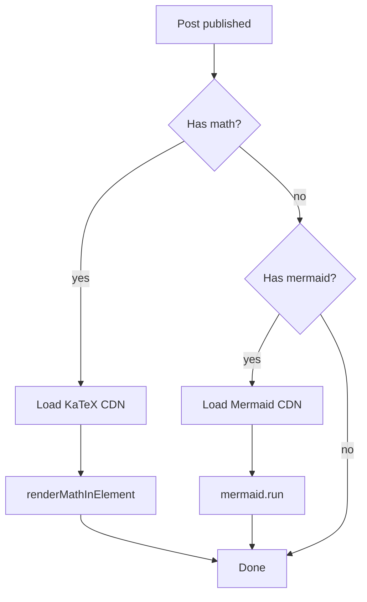
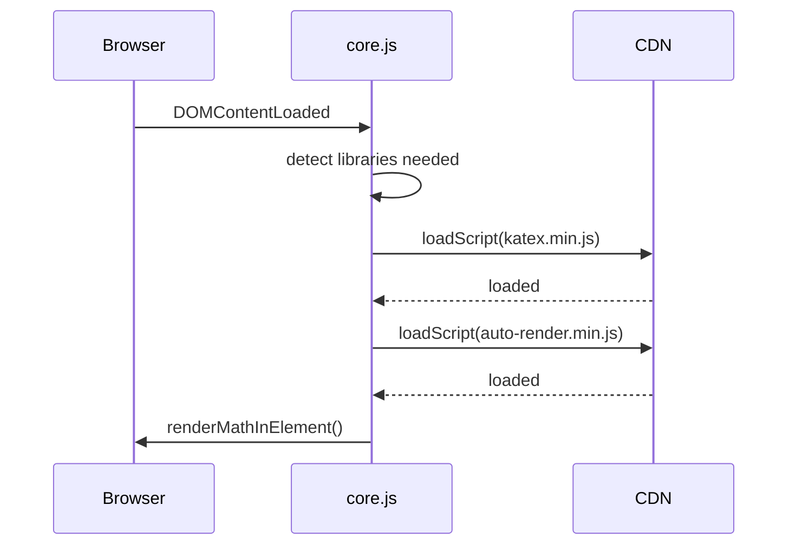
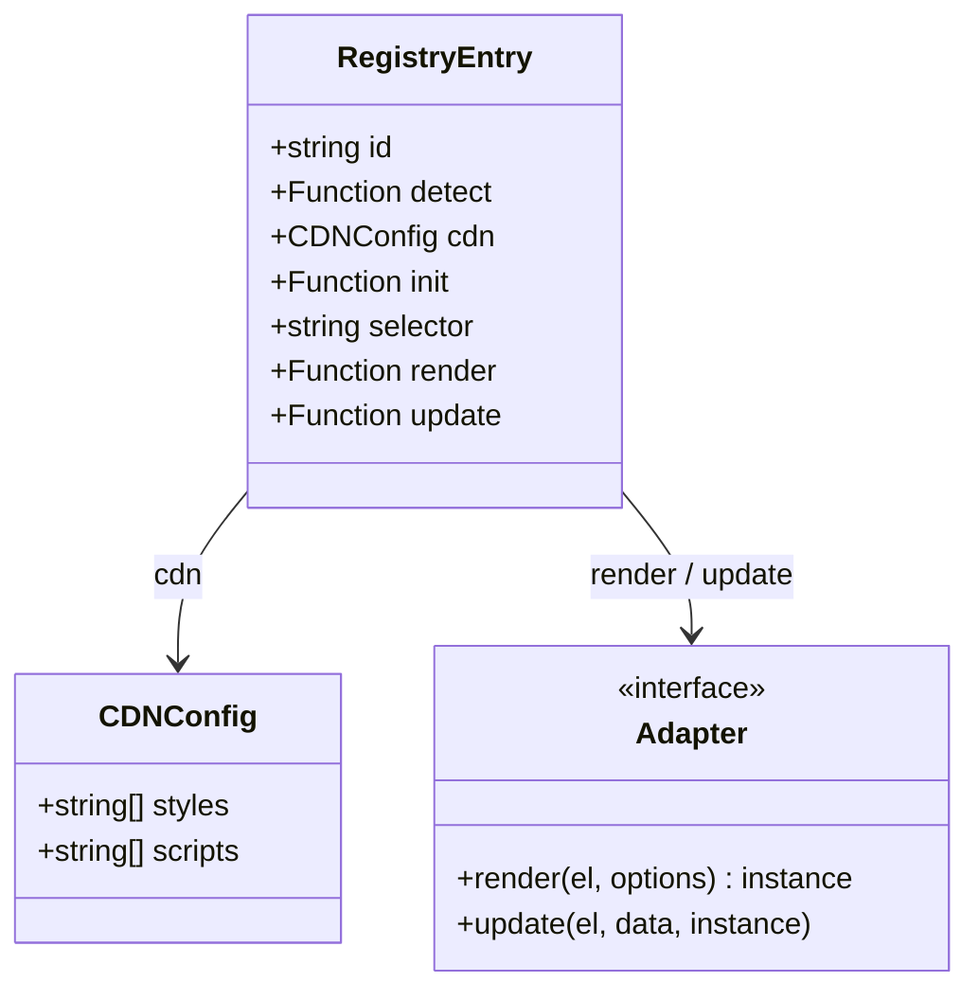

This post demonstrates the two text-rendering libraries built into the theme: **KaTeX** for mathematics and **Mermaid** for diagrams. Both are loaded automatically when the runtime detects the relevant content — no front-matter flags needed, though you can add `math: true` or `diagram: true` to force-load them.

## KaTeX mathematics

Inline math is delimited with single dollar signs. The Pythagorean theorem states $a^2 + b^2 = c^2$, and Euler's identity is $e^{i\pi} + 1 = 0$.

Display math uses double dollar signs on their own lines:

$$
\int_{-\infty}^{\infty} e^{-x^2}\, dx = \sqrt{\pi}
$$

The Navier–Stokes momentum equation for an incompressible Newtonian fluid:

$$
\rho \left(\frac{\partial \mathbf{u}}{\partial t} + (\mathbf{u} \cdot \nabla)\mathbf{u}\right) = -\nabla p + \mu \nabla^2 \mathbf{u} + \mathbf{f}
$$

Taylor series expansion about $x = a$:

$$
f(x) = \sum_{n=0}^{\infty} \frac{f^{(n)}(a)}{n!}(x - a)^n
$$

LaTeX backslash notation also works for inline \( \sigma = \sqrt{\text{Var}(X)} \) and display mode:

$$
\mathbf{A}\mathbf{x} = \lambda \mathbf{x}
$$

### Rendering details

KaTeX is loaded from CDN and triggered by `renderMathInElement` on the `.gh-content` container. The runtime detects the `$` character in content text and loads KaTeX automatically — no flag needed. Setting `math: true` in front matter adds `tag-hash-math` to the `<body>` class, which forces loading even when the content section hasn't rendered yet.

---

## Mermaid diagrams

Mermaid diagrams are written as fenced code blocks with the language set to `mermaid`. Ghost and Jekyll both render these as `<code class="language-mermaid">`, and the runtime converts them to `
` before passing to Mermaid's renderer.

### Flowchart

### Sequence diagram

### Class diagram

### Rendering details

Mermaid v10+ is used, which requires calling `mermaid.run({ nodes })` rather than the deprecated `mermaid.init()`. The runtime handles both versions for compatibility. Theme is set to `dark` when `data-theme="dark"` is on the `<html>` element, so diagrams match the current colour scheme.
